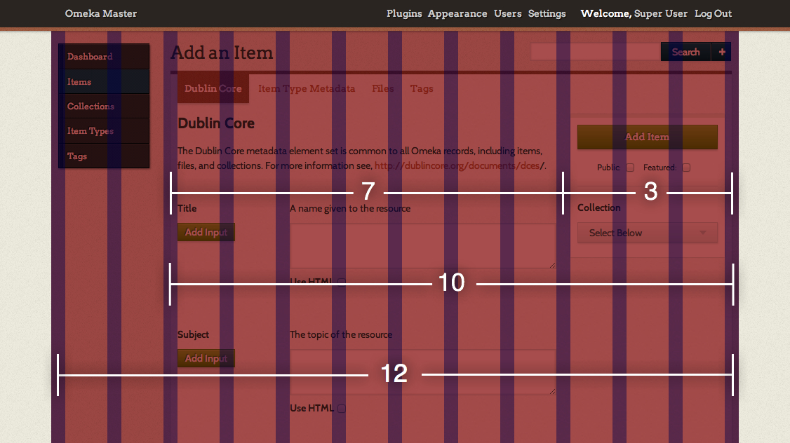

###########################
Understanding the Admin CSS
###########################

The Omeka admin theme uses `Skeleton development kit <http://getskeleton.com/>`_ for
easy, responsive styles. Each page consists of a twelve-column grid, with sections'
columns defined by CSS classes. For example, a three column section would have the
classes "three columns". 

The first two columns are dedicated to navigation, while the latter ten hold the main
content. Admin views, including those added by plugins, are therefore contained within
ten columns, and plugin writers should look to the structure of other admin views for
markup patterns.

-----
Forms
-----

Within the main content, Omeka forms typically take up seven columns, and leave the last
three for a save panel that follows the user down the page. The following is an example
of markup from a typical admin form. The "alpha" class signifies the first set of columns
within a set, and "omega" signifies the last set of columns. These classes modify the left
and right margins respectively.

.. code-block:: html

    <form method="post" enctype="multipart/form-data" action="">
        <section class="seven columns alpha">
            <!-- The main body of the form -->
        </section>
        <section class="three columns omega">
            

                <!-- Submit button(s) and other small controls -->
            

        </section>
    </form>

For reference:

* `Official Skeleton website <http://getskeleton.com/>`_
* `Build a Responsive, Mobile-Friendly Web Page With Skeleton <http://designshack.net/articles/css/build-a-responsive-mobile-friendly-web-page-with-skeleton/>`_ (For a more detailed guide on understanding and using Skeleton.)
